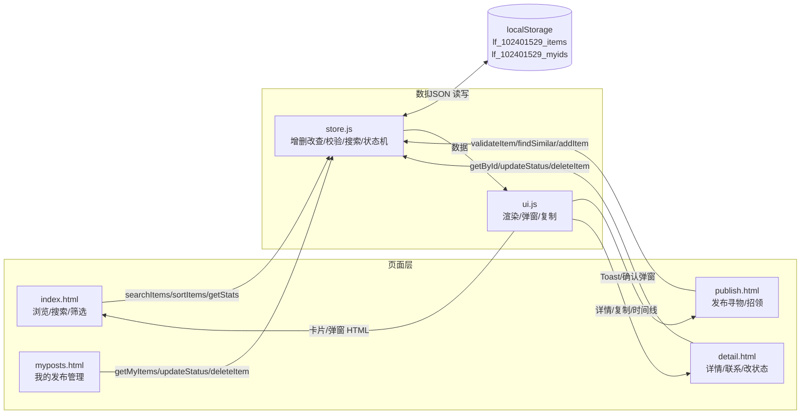
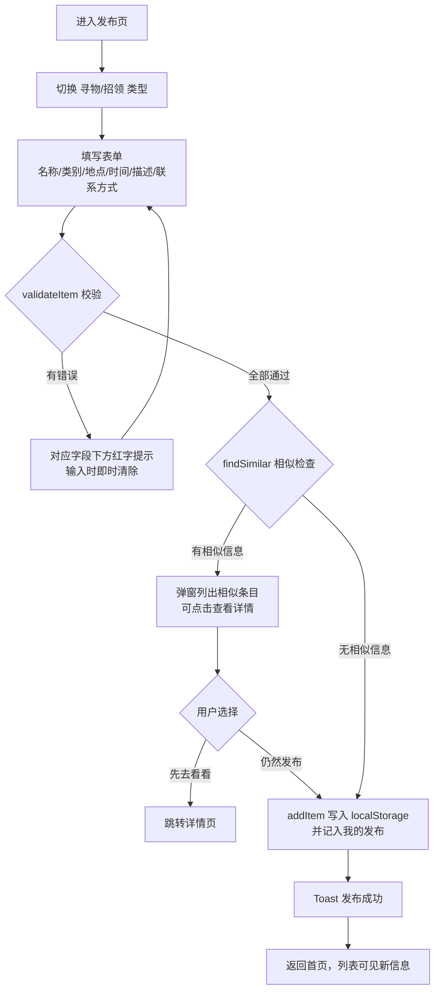
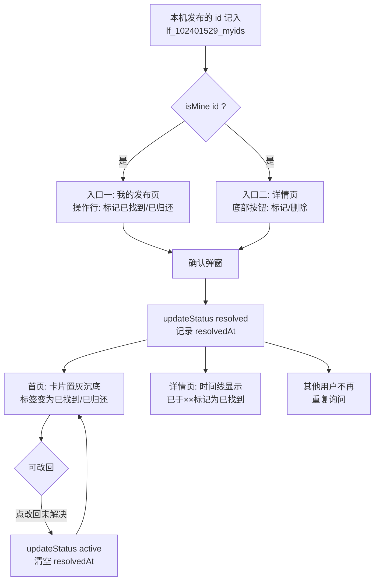
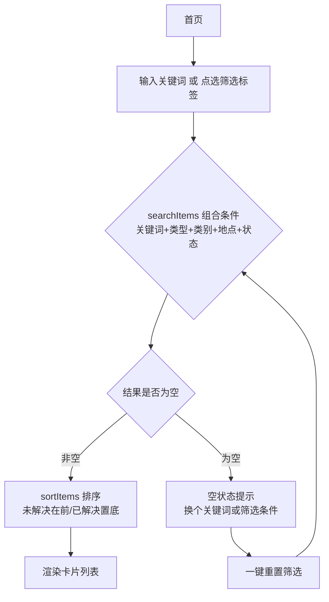

# 校园失物招领 —— 第二次结对作业（程序实现）

> 学号：102401529　姓名：陈加豪　｜　学号：102401521　姓名：陈辉腾
> 2026秋软件工程第二次结对作业

## 一、开头信息

- 结对同学博客链接：【待填：队友第一次/第二次作业博客 URL】
- 本作业博客链接：【https://edu.cnblogs.com/campus/fzu/202601SofwareEngineering/homework/16744】
- GitHub 项目地址：【https://github.com/Aranya12138/102401529-102401521】

> 项目已在班级群统计表中登记。分工、PSP、设计说明、测试等详见下文。

## 二、具体分工

| 成员 | 负责内容 |
| --- | --- |
| 102401529 陈加豪 | 数据层 js/store.js 设计与实现、单元测试编写、README 文档 |
| 102401521 陈辉腾 | 页面结构（4 个 HTML）、css/style.css 样式、博客撰写与排版 |

两人共同完成：需求与功能划分讨论、设计复审、全流程走查测试、GitHub 协作（建仓/fork/PR）、示例数据设计。

## 三、PSP 表格

| PSP2.1 | Personal Software Process Stages | 预估耗时（分钟） | 实际耗时（分钟） |
| --- | --- | ---: | ---: |
| Planning | 计划 | 30 | 30 |
| Estimate | 估计这个任务需要多少时间 | 20 | 20 |
| Development | 开发 | 750 | 820 |
| Analysis | 需求分析（包括学习新技术） | 60 | 60 |
| Design Spec | 生成设计文档 | 40 | 30 |
| Design Review | 设计复审 | 30 | 30 |
| Coding Standard | 代码规范（为目前的开发制定合适的规范） | 20 | 20 |
| Design | 具体设计 | 60 | 80 |
| Coding | 具体编码 | 360 | 400 |
| Code Review | 代码复审 | 60 | 80 |
| Test | 测试（自我测试，修改代码，提交修改） | 120 | 120 |
| Reporting | 报告 | 120 | 100 |
| Test Report | 测试报告 | 60 | 40 |
| Size Measurement | 计算工作量 | 15 | 10 |
| Postmortem & Process Improvement Plan | 事后总结，并提出过程改进计划 | 45 | 50 |
| 合计 | | 920 | 970 |

**偏差分析**：总耗时 970 分钟，比预估多 50 分钟（+5.4%），整体可控，但偏差方向很有规律——**实现类活动系统性超时**（Coding +40：低估了原型转真实实现的交互调试成本；Code Review +20：复审发现两人接口不一致并修复返工；Design +20：store.js 双环境与状态机设计反复推敲），**文档类活动系统性节省**（Test Report -20：node:test 报告现成、用例思路已在博客整理；Design Spec -10：沿用第一次作业原型规格；Size Measurement -5：脚本化统计）。特别说明：Test 阶段表面持平，实际包含了一次排查 `node --test` 目录参数报错的返工——如实记录才保住了这条经验。

**过程改进计划**：①Coding 预估按"原型工作量 × 1.5"或把交互调试单列；②数据层函数签名清单纳入 Design 产出、接口先行，减少复审返工；③docs/ 模板库复用，文档类阶段按本次实际值下调；④Test 保留 10%~20% 返工 buffer；⑤继续脚本化度量（扩展到代码行数统计）。完整分析见仓库 docs/PSP.md。

## 四、解题思路描述与设计实现说明

### 4.1 代码实现思路（文字描述）

第一次作业我们完成了原型设计（375×667 移动端风格的原型，共 5 个页面），本次在其基础上把它变成真正可用的程序。几个关键决策：

**1. 技术选型：纯 HTML + CSS + 原生 JS，零依赖零构建。** 本次作业要求"其他同学下载所有文件后用 Chrome 打开 html 文件就能展现预期结果"，因此我们刻意不用任何框架和构建工具，也避免使用需要服务器或安装依赖的方案。双击 `index.html` 即可运行，最大程度降低测试人员的复现成本。

**2. 数据持久化：localStorage + 项目命名空间。** 没有后端，发布的信息必须存在浏览器里。localStorage 天然满足"本机持久化 + 同浏览器多标签页共享"。这里有一个隐蔽的坑：Chrome 下所有 file:// 页面共享同一个 origin，如果键名随便起（比如叫 `items`），可能与别人的项目数据串扰。所以我们的键名带项目命名空间 `lf_102401529_items`。此外我们在读取时做了两层防御：JSON 解析失败当空数据处理、localStorage 不可用时（个别隐私模式会抛 SecurityError）自动降级为内存存储，保证功能在任何环境都可用。

**3. 架构分层：页面层 / UI 层 / 数据层三层分离。** 所有数据逻辑（增删改查、搜索筛选、表单校验、状态机、相对时间）收敛在 `js/store.js`；所有展示逻辑（卡片渲染、弹窗、Toast、复制）收敛在 `js/ui.js`；4 个 HTML 页面只做事件绑定。这样代码职责清晰，而且**数据层可以在 Node 里直接被单元测试加载**——store.js 用 `module.exports` 导出、存储实现可注入内存模拟，测试时不需要浏览器。

**4. 状态机设计（本次作业的核心闭环）。** 一条信息只有两种状态：`active`（未解决）与 `resolved`（已解决）。展示文案按类型区分：寻物解决显示"已找到"、招领解决显示"已归还"。状态由发布者修改，可双向切换（改回未解决时清空 resolvedAt）。系统通过 `lf_102401529_myids` 记录本机发布过的 id 来识别"谁是发布者"，据此在"我的发布"页和详情页开放操作按钮。

**5. 把第一次作业被点评的问题补上。** 老师点评中提到"联系之后如何结束这条信息没有展开"——本次我们实现了完整的状态闭环（谁来改、从哪改、改完别人在哪看到结果，见 4.2 图 3）；"发布信息不完整、搜索无结果没有提示"——本次实现逐字段红字校验和搜索空状态引导；"透明点击区域不响应"——本次所有交互都做了全流程走查。

### 4.2 关键实现的流程图与数据流图

（图 1～图 4 的 mermaid 源码见仓库 docs/数据流图.md，此处贴出渲染结果；若博客园无法渲染 mermaid，可在 mermaid.live 导出图片插入）

**图 1 系统整体数据流图：** 4 个页面只通过 store.js 读写数据，store.js 负责与 localStorage 交互，ui.js 负责渲染——页面不直接碰存储，逻辑不散落在页面里。



**图 2 发布信息流程：** 先校验、再查重（相似提醒）、最后入库，任何一步不通过都有明确反馈。



**图 3 状态更新流程（状态闭环）：** 回答"谁来改、从哪个入口改、修改后其他用户在哪里看到结果"三个问题。



**图 4 搜索筛选流程：** 关键词与类别/地点/状态任意组合，结果按"未解决在前、已解决置底"排序，无结果给空状态引导。



### 4.3 重要的/有价值的代码片段与解释

**片段一：状态机与"发布者识别"（js/store.js）**

```javascript
/** 状态文案：寻物解决=已找到，招领解决=已归还（核心状态机对外表现） */
function statusText(item) {
  if (item.status === 'resolved') {
    return item.type === 'lost' ? '已找到' : '已归还';
  }
  return '未解决';
}

/** 更新状态：'active'（未解决）<-> 'resolved'（已找到/已归还），可双向切换 */
function updateStatus(id, status, now) {
  if (status !== 'active' && status !== 'resolved') return null;
  var items = loadItems();
  for (var i = 0; i < items.length; i++) {
    if (items[i].id === id) {
      items[i].status = status;
      items[i].resolvedAt = status === 'resolved'
        ? new Date(now || Date.now()).toISOString()
        : null;
      saveItems(items);
      return items[i];
    }
  }
  return null;
}
```

解释：状态机是整个闭环的核心。标记解决时记录 resolvedAt（详情页的时间线就靠它），改回未解决时清空；非法状态值和不存在的 id 都返回 null 不破坏数据——这两类情况后来都进了单元测试。

**片段二：搜索与置底排序（js/store.js）**

```javascript
/** 组合搜索：关键词（匹配名称+描述，大小写不敏感）+ 类型/类别/地点/状态筛选 */
function searchItems(opts) {
  opts = opts || {};
  var kw = String(opts.keyword || '').trim().toLowerCase();
  var items = loadItems();
  return items.filter(function (it) {
    if (kw) {
      var name = String(it.name || '').toLowerCase();
      var desc = String(it.desc || '').toLowerCase();
      if (name.indexOf(kw) === -1 && desc.indexOf(kw) === -1) return false;
    }
    if (opts.type && it.type !== opts.type) return false;
    if (opts.category && it.category !== opts.category) return false;
    if (opts.location && it.location !== opts.location) return false;
    if (opts.status && it.status !== opts.status) return false;
    return true;
  });
}

/** 列表排序：未解决在前（按发布时间倒序），已解决置底（按解决时间倒序） */
function sortItems(list) {
  var copy = list.slice();
  copy.sort(function (a, b) {
    var ra = a.status === 'resolved' ? 1 : 0;
    var rb = b.status === 'resolved' ? 1 : 0;
    if (ra !== rb) return ra - rb;
    var ta = ra ? (a.resolvedAt || '') : (a.createdAt || '');
    var tb = rb ? (b.resolvedAt || '') : (b.createdAt || '');
    return ta < tb ? 1 : (ta > tb ? -1 : 0);
  });
  return copy;
}
```

解释：搜索不是简单的 `indexOf`，关键词要同时匹配名称和描述；筛选条件全部省略时退化为"返回全部"。排序先按状态分组（未解决在前），组内再按时间倒序——已解决的信息既保留可查、又不打扰需要帮助的人。sortItems 返回新数组不修改原数据，避免页面间相互污染。

**片段三：HTML 转义 + 剪贴板复制降级（js/ui.js）**

```javascript
/** HTML 转义，用户输入渲染前必须调用 */
function esc(s) {
  return String(s == null ? '' : s)
    .replace(/&/g, '&amp;').replace(/</g, '&lt;').replace(/>/g, '&gt;')
    .replace(/"/g, '&quot;').replace(/'/g, '&#39;');
}

/** 复制文本到剪贴板：Clipboard API 优先，失败降级 execCommand */
function copyText(text, done) {
  function fallback() {
    var ta = document.createElement('textarea');
    ta.value = text;
    ta.style.cssText = 'position:fixed;left:-9999px;top:0;';
    document.body.appendChild(ta);
    ta.select();
    var ok = false;
    try { ok = document.execCommand('copy'); } catch (e) { ok = false; }
    document.body.removeChild(ta);
    done(ok);
  }
  if (navigator.clipboard && navigator.clipboard.writeText) {
    navigator.clipboard.writeText(text).then(
      function () { done(true); },
      function () { fallback(); }
    );
  } else {
    fallback();
  }
}
```

解释：用户发布的内容是渲染进 innerHTML 的，如果带 HTML 标签会破坏页面甚至注入脚本，所以所有用户输入渲染前都要转义——这是我们定下的编码规范。复制功能则要面对"不同环境 Clipboard API 可用性不一"的问题：Promise 失败时降级为隐藏 textarea + execCommand 的老方案，两种结果都有对应的 Toast 反馈。

## 五、附加特点设计与展示

### 特点 1：一键复制联系方式

**创意与意义**：联系方式是"联系发布者"这一步的唯一载体，微信/QQ/手机号一旦记错就前功尽弃。一键复制把"记住并手动输入"变成"点一下、粘一下"，消灭抄写错误。

**实现思路**：详情页"联系发布者"弹窗内提供复制按钮，优先调用 Clipboard API（file:// 在 Chrome 中属于安全上下文），Promise 拒绝时自动降级为隐藏 textarea + `document.execCommand('copy')`（见 4.3 片段三）。复制结果用 Toast 即时反馈（成功/失败两种文案，失败提示手动复制路径）。

**代码片段**：见 4.3 片段三的 `copyText`；调用侧为弹窗内绑定按钮后 `UI.copyText(item.contact, cb)`。

**成果展示**：
联系发布者弹窗：


复制成功 Toast：


### 特点 2：发布前的相似信息提醒（防重复发帖）

**创意与意义**：校园场景里同一条失物最容易被反复发布（失主和多个捡到者各自发帖）。发布前自动查找"同类型、未解决、名称相近"的已有信息并弹窗提醒，既能帮发布者直接找到对方，也减少首页的信息噪音。

**实现思路**：`findSimilar` 在数据层实现（名称互相包含且至少 2 个字、类型一致、未解决）。发布按钮的流程变为：校验 → 查相似 → 有命中则弹窗列出（每项可点击跳详情）→ 用户选择"先去看看"或"仍然发布"。它拦在 `addItem` 之前，不影响最终发布权。

**代码片段**：

```javascript
function findSimilar(form) {
  var name = String(form.name || '').trim();
  if (name.length < 2) return [];
  return loadItems().filter(function (it) {
    if (it.type !== form.type || it.status !== 'active') return false;
    var other = String(it.name || '').trim();
    return other.length >= 2 && (other.indexOf(name) !== -1 || name.indexOf(other) !== -1);
  });
}
```

解释：名称互相包含（"校园卡" 与 "校园卡（蓝色贴纸）"互相命中）比完全相等更贴合真实输入习惯；已解决的信息不参与提醒，因为它已不再是"正在找"的对象。

**成果展示**：
发布"校园卡"时的相似信息提醒弹窗：


### 特点 3：类别/地点/状态组合筛选 + 一键重置

**创意与意义**：只靠关键词搜不到"图书馆捡到的所有电子产品"。三个维度的标签筛选可与关键词任意叠加，条件之间是"与"的关系；筛选复杂后一键重置避免用户逐个取消。

**实现思路**：首页筛选状态集中在 `state` 对象（tab/keyword/category/location/status），任何操作只改 state 再统一 `render()`——渲染逻辑只有一份，不会出现"改了 A 忘了 B"的状态不同步。chips 按 data-* 属性分组绑定，同类互斥。

**成果展示**：
筛选"电子产品 × 图书馆 × 未解决"的组合结果：


### 特点 4：统计条与"已解决置底 + 相对时间"

**创意与意义**：统计条（全部/待解决/已解决/解决率）让用户对平台价值一目了然，也暗示"在这里发帖真的能找回东西"；列表按状态排序让求助信息优先被看到；相对时间（今天 10:30/昨天/3天前）比一长串日期更易读。

**实现思路**：`getStats` 每次渲染时重算（数据量小，实时计算即可）；`sortItems` 先按状态分组再按时间倒序（见 4.3 片段二）；`formatTime` 按"日期差"分级显示，超过一周退回具体日期。

**成果展示**：
首页统计条 + 已解决卡片置灰沉底的效果：


## 六、目录说明和使用说明

### 目录组织

```
campus-lost-found/
├── index.html        首页：统计条、搜索框、全部/寻物/招领标签页、
│                     类别/地点/状态组合筛选、信息卡片列表、底部 Tab 栏
├── publish.html      发布页：寻物/招领类型切换、信息表单（带校验）、
│                     相似信息提醒、发布成功提示
├── detail.html       详情页：物品完整信息、联系发布者（一键复制联系方式）、
│                     状态时间线；本人发布的信息可标记状态、删除
├── myposts.html      我的发布：管理自己发布的信息（查看/修改状态/删除）
├── css/style.css     全部页面共用的样式（沿用第一次作业原型的设计语言）
├── js/store.js       数据层：localStorage 读写、增删改查、搜索筛选、
│                     表单校验、相似提醒、状态机、相对时间、示例数据
├── js/ui.js          共享 UI 层：卡片渲染、空状态、Toast、确认弹窗、
│                     剪贴板复制（带降级方案）、HTML 转义
├── test/             单元测试（node:test，按作业要求不上传）
├── docs/             博客素材：PSP、流程图、协作流程文档
├── README.md         目录说明与使用说明（评分者入口）
└── package.json      仅提供 npm test 脚本，无任何第三方依赖
```

### 使用说明（测试人员版）

1. **运行**：下载全部文件，保持目录结构不变，用 **谷歌浏览器** 双击打开 `index.html`。无需安装任何软件（运行单元测试才需要 Node.js 18+）
2. **首次打开**自动载入 8 条示例数据，可直接体验全部功能
3. **核心流程走查**：首页浏览/搜索"校园卡" → 点卡片看详情 → 联系发布者（弹窗 + 一键复制）→ 底部"发布"填表单（试试留空必填项看红字提示）→ 发布成功 → "我的"里"标记已找到/已归还" → 回首页看卡片置灰沉底、统计条数字变化 → "删除"走二次确认
4. **注意事项**：数据保存在本机浏览器的 localStorage 中，换浏览器/换电脑数据不同属正常现象；想重置示例数据按 F12 控制台执行 `localStorage.clear()` 后刷新

## 七、单元测试

### 7.1 测试工具的选择、学习过程与简易教程

**工具**：Node.js 内置的 **node:test**（Node 18+ 自带）+ 内置 `assert` 断言库。

**为什么选它**：本次作业附录推荐了 Mocha、Jest 等框架，但它们都需要 npm 安装依赖，而我们的项目原则是"测试人员零安装成本"。node:test 是 Node 官方内置模块，任何装了 Node 18+ 的机器上 `npm test` 直接就能跑，与"纯原生 JS"的技术路线一致。运行方式：`npm test`（等价于 `node --test "test/*.test.js"`），28 个用例全绿。

**学习过程**：我们阅读了 Node 官方文档中 Test runner 章节和廖雪峰老师的 JS 教程，先写最小示例跑通"测试失败会怎样报错"，再按"先测数据层、后补边界"的顺序逐步补全用例。

**简易教程（给第一次接触单元测试的同学）**：

1. 装好 Node.js 18+，项目根目录建 `test/` 文件夹，写 `xxx.test.js`
2. 引入测试模块：`const { test, beforeEach } = require('node:test');` 和 `const assert = require('node:assert/strict');`
3. 每个用例就是一个 `test('用例名', () => { ... })`，里面用 `assert.equal(实际值, 期望值)` 等断言；断言失败会报出具体行号与差异
4. `beforeEach` 在**每个用例之前**执行，用来重置测试环境（我们用它在每个用例前注入全新的内存存储，保证用例互不影响）
5. 运行：`node --test "test/*.test.js"`；看到 `pass N, fail 0` 即全部通过
6. 常用断言：`assert.equal`（相等）、`assert.deepEqual`（对象/数组内容相等）、`assert.ok`（真值）、`assert.notEqual`、`assert.throws`（期待抛异常）

### 7.2 项目部分单元测试代码与说明

被测对象是**数据层 store.js**（所有业务逻辑所在），共 28 个用例。摘录几组：

```javascript
const { test, beforeEach } = require('node:test');
const assert = require('node:assert/strict');
const Store = require('../js/store.js');

let NOW;
beforeEach(() => {
  Store._setStorage(Store.createMemoryStorage()); // 每个用例独立的内存存储
  NOW = new Date(2026, 9, 5, 12, 0, 0).getTime(); // 固定"当前时间"，可复现
});

/* 测 validateItem：全空表单五个必填项全部报错 */
test('validateItem：全空表单，五个必填项全部报错', () => {
  const { errors } = Store.validateItem(
    { type: 'lost', name: '', category: '', location: '', time: '', desc: '', contact: '' }, NOW);
  assert.deepEqual(Object.keys(errors).sort(),
    ['category', 'contact', 'location', 'name', 'time']);
});

/* 测状态机：寻物解决=已找到、招领解决=已归还、可双向切换 */
test('updateStatus：寻物标记解决后显示"已找到"并记录 resolvedAt', () => {
  const item = Store.addItem(validForm(), NOW);
  Store.updateStatus(item.id, 'resolved', NOW);
  const after = Store.getById(item.id);
  assert.equal(after.status, 'resolved');
  assert.equal(Store.statusText(after), '已找到');
  assert.ok(after.resolvedAt);
});

test('updateStatus：可改回未解决，resolvedAt 被清空', () => {
  const item = Store.addItem(validForm(), NOW);
  Store.updateStatus(item.id, 'resolved', NOW);
  Store.updateStatus(item.id, 'active', NOW);
  const after = Store.getById(item.id);
  assert.equal(after.status, 'active');
  assert.equal(after.resolvedAt, null);
});

/* 测排序：未解决在前、已解决置底，且不修改原数组 */
test('sortItems：未解决在前按发布时间倒序，已解决置底', () => { ... });

/* 测搜索：英文大小写不敏感、命中描述、组合筛选、无结果返回 [] */
test('searchItems：类型+类别+地点组合筛选（条件之间是与的关系）', () => { ... });

/* 测相似提醒：同类型未解决名称相近才命中，已解决/不同类型不参与 */
test('findSimilar：不同类型、已解决、名称过短都不参与提醒', () => { ... });

/* 测相对时间：今天/昨天/N天前/超过一周显示日期 */
test('formatTime：今天/昨天/N天前/超过一周显示日期', () => { ... });
```

【完整 28 个用例见 test/store.test.js】

### 7.3 构造测试数据的思路与对"刁难"的考虑

**设计原则：正常值、边界值、组合、异常四类齐全。**

- **正常值**：一份"合法表单"工厂函数 `validForm()`，覆盖发布成功的完整字段，作为多数用例的基线，保证"正常路径真的能用"
- **边界值**：名称恰好 20 字（通过）与 21 字（报错）；联系方式 50/51 字；描述 200/201 字；时间"1 分钟前"（通过）与"1 小时后"（报错）——边界两侧都要测，因为 off-by-one 是最常见的 bug
- **组合**：类型+类别+地点三个筛选条件叠加验证"与"关系；相似提醒验证"类型不同/已解决/名称过短"三种排除情形
- **异常**：全空表单、无法解析的时间字符串、不存在的 id（查询/改状态/删除）、非法状态值、空数据下统计不除零、重复删除、seed 重复初始化幂等
- **环境隔离**：每个用例注入全新内存存储、固定 NOW 时间戳，任何用例跑挂都能单独复现，互相不污染

**如何考虑测试人员的刁难**：评分者会按 README 操作之外，还可能做三件事——①发布一条什么都不填的信息（全空校验已覆盖）；②疯狂点"修改状态"来回切换（双向切换 + 非法值防护已覆盖）；③在搜索框输入奇怪字符（中文、英文大小写、不存在词均已覆盖，无结果返回空数组而非报错）。另外我们给所有"渲染用户输入"的地方加了 HTML 转义，防止有人发布带 `<script>` 的内容破坏页面。

## 八、GitHub 签入记录

两人按功能划分、每完成一个功能至少 commit 一次，commit message 遵循"类型: 说明"的规范（feat 功能 / docs 文档 / chore 杂项）：

| 提交 | 说明 |
| --- | --- |
| `chore: 初始化项目结构与.gitignore` | 目录结构、package.json、gitignore |
| `feat: 数据层store.js与示例数据` | localStorage 封装、CRUD、校验、搜索、状态机、seed |
| `feat: 首页列表与搜索筛选` | 统计条、Tab、搜索框、组合筛选、卡片流 |
| `feat: 发布页、表单校验与相似提醒` | 分段控件、红字校验、相似弹窗、成功 Toast |
| `feat: 详情页、联系发布者与一键复制` | 详情渲染、复制降级、时间线、发布者操作入口 |
| `feat: 我的发布、状态更新与删除` | 我的发布列表、改状态、删除 |
| `feat: 附加特点与界面完善` | localStorage 受限降级、下拉框细节 |
| `docs: README目录说明与使用说明` | README 文档 |


## 九、遇到的代码模块异常或结对困难及解决方法

**问题 1：`node --test test/` 目录参数在 Windows 上报错**
- 问题描述：按 Node 文档用目录路径运行测试，报 `MODULE_NOT_FOUND`，node 把目录当成模块入口去 require
- 做过哪些尝试：换 `test/`、`test` 两种写法均失败；改用显式文件路径 `node --test test/store.test.js` 成功
- 是否解决：已解决，最终在 package.json 里用 glob 写法 `node --test "test/*.test.js"`，跨平台通用
- 有何收获：跨平台工具的参数差异要在自己目标环境实测，不能只信文档示例；把结论写进 README，避免测试人员踩同一个坑

**问题 2：localStorage 在 file:// 下的 origin 共享风险**
- 问题描述：设计数据持久化时发现 Chrome 中所有 file:// 页面共享同一 origin，若键名起得太通用，可能与他组项目数据串扰
- 做过哪些尝试：查阅 Chrome 安全模型资料确认 file:// 行为；尝试直接使用发现页面可用但键名冲突风险存在
- 是否解决：已解决，键名加项目命名空间前缀 `lf_102401529_items` / `lf_102401529_myids`
- 有何收获：本地文件应用的"沙箱边界"与 web 应用不同，环境特性要提前调研而不是上线后才发现

**问题 3：复制功能在部分环境不可用**
- 问题描述：Clipboard API 在个别浏览器/受限上下文里 Promise 会 reject
- 做过哪些尝试：查文档确认 file:// 在 Chrome 属安全上下文、API 可用，但为了稳妥做双保险
- 是否解决：已解决，实现 execCommand 降级方案，两种路径都给用户 Toast 反馈（成功/失败提示手动复制）
- 有何收获：前端能力要用"渐进增强"思路：新 API 优先、老方案兜底、失败要提示

**问题 4：结对协作中进度合并困难**
- 问题描述：两人分头开发时，页面事件绑定与数据层接口约定不清，出现过字段名不一致导致的空渲染
- 做过哪些尝试：约定 store.js 作为唯一数据接口并先行定义函数签名；页面层禁止直接访问 localStorage；合并前互相做代码复审
- 是否解决：已解决，后续开发没有再出现接口不一致问题
- 有何收获：先定接口、后写页面，比各自写完再对接省一半时间；结对编程的复审环节能拦住大部分低级 bug

## 十、评价我的队友

**值得学习的地方**：
陈加豪同学在本次结对作业中负责数据层 js/store.js、单元测试和 README，完成质量很高，有很多值得我学习的地方：

1.数据层抽象清晰：把增删改查、表单校验、搜索筛选、状态机、相对时间等逻辑全部收敛到 store.js，并给出稳定的函数接口，页面层不直接操作 localStorage，从源头避免了逻辑散落和重复实现。

2.测试意识强：用 node:test 写了 28 个用例，覆盖正常值、边界值、组合条件和异常情况；通过注入内存存储、固定 NOW 时间戳，让用例可复现、互不污染，这种“可测试性设计”很值得学习。

3.工程细节严谨：localStorage 命名空间、JSON 解析失败降级、隐私模式降级、HTML 转义、剪贴板复制降级等异常路径都提前考虑到了，代码不只是在“能跑”的层面，而是考虑了真实环境下的稳定性。

4.文档和复盘到位：README 把目录结构、运行方式、测试命令、重置数据方法写得很清楚；遇到 node --test 目录参数、file:// origin 共享等问题也如实记录在博客和 docs 中，方便后续复查。

5.沟通配合可靠：讨论需求时能主动给出接口签名和字段约定，联调阶段也愿意一起排查问题，是让人放心的队友。

**需要改进的地方**：
1.接口如果发生调整，可以更早同步到页面层，最好维护一份简短的“数据层函数签名/字段变更”清单，减少联调时的字段不一致返工。

2.关键函数可以再补一点“为什么这样设计”的注释，比如状态机为什么允许双向切换、命名空间为什么用 lf_102401529，方便队友和评分者快速理解。

3.联调阶段可以更早介入页面走查，不必等页面基本完成后集中修问题；commit 也可以再细粒度一些，按功能点拆分，便于回滚和 review。

总体而言，陈加豪同学逻辑严谨、交付可靠，本次数据层和测试部分质量很高，和这样的队友合作很省心。


> 附：本博客配套资料（PSP 表、数据流图 mermaid 源码、GitHub 协作流程）均已归档在项目仓库 docs/ 目录，供复查。
